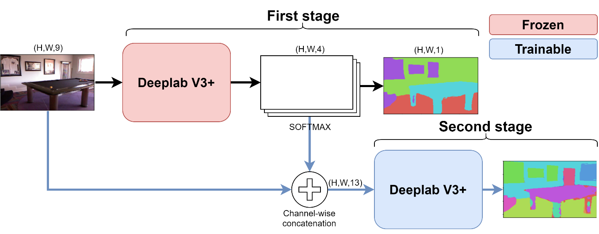

# IL-Coarse2Fine
This repository contains the code for the paper: "Incremental and Multi-Task Learning Strategies for Coarse-to-Fine Semantic Segmentation", Technologies 2020 vol.8 num. 1, special issue on Computer Vision and Image Processing Technologies. The full paper can be found [here](https://www.mdpi.com/2227-7080/8/1/1).

If you find this code useful please cite our paper as:

```
@article{mel2020coarse,
  title={{Incremental and Multi-Task Learning Strategies for Coarse-to-Fine Semantic Segmentation}},
  author={Mel, Mazen and Michieli, Umberto and Zanuttigh, Pietro},
  journal={Technologies, special issue on Computer Vision and Image Processing Technologies},
  year={2020},
  volume={8},
  number={1}
}
```


## Approach
We propose a few incremental and multi-Task learning strategies for indoor semantic segmentation. The approaches have been tested on the [NYUV2](https://cs.nyu.edu/~silberman/datasets/nyu_depth_v2.html) dataset. Our approach can be separated into two parts:
1) The first part focuses on knowledge transfer strategies from coarse to fine semantic segmentation. 
2) The second part proposes a multi-task like approach for simultaneous output of different semantic segmentation maps with different number of classes.


## Model
* The DeepLab V3+ network is a state-of-the-art method for semantic segmentation. We used it as the base model in our approach and modified the input as well as the output layers depending on the target task we wanted to perform.
The original keras implementation of DeepLab v3+ that we used is available at: https://github.com/bonlime/keras-deeplab-v3-plus
* [Xception](https://arxiv.org/abs/1610.02357) from François Chollet is the feature extractor used in this version of DeepLab V3+. We used the Xception pre-trained weights on PASCAL VOC dataset available [here](https://github.com/bonlime/keras-deeplab-v3-plus/releases/download/1.1/deeplabv3_xception_tf_dim_ordering_tf_kernels.h5)


## Setup
* Download the [NYUV2](https://cs.nyu.edu/~silberman/datasets/nyu_depth_v2.html) dataset (795 training images and 654 test images) with the three sets of labeling (4, 13, and 40 classes). Note that we used pre-processed version of the dataset where the surface normals are added to the RGB and depth channels, refer to this [paper](https://ieeexplore.ieee.org/document/8120042). 
* Place the input tensors (in our case `.mat` files) in `TrainImages/`and label images in `TrainLabels/`, repeat the same for the testset.

## Training
Depending on the task that you want to perform you should fix the input parameters upon the call of the `Deeplabv3` function to build the model:
* For the multi-task approach enable `multi_task = True`. You should also duplicate the loss function for each of the outputs in `model.compile`.
* Set the incremental learning approach `IL_approach` and prepare the corresponding predicted outputs from the previous stage.
One way to do that is to store the predictions in a separate directory and then include the files in `getImageArr` function to be later used by the DataLoader.

## Software Requirements
* The code has been tested with Keras 2.2.4, Tensorflow 1.15, and CUDA 9.0

## Hardware Setup
* We used the following components:
  * OS: Microsoft Windows 10.
  * CPU: Intel(R) Core(TM) i7 CPU 970@3.2Ghz.
  * GPU: NVIDIA Tesla K40 with 12 GB of memory.

# License

This work is licensed under the Creative Commons Attribution-NonCommercial-ShareAlike 4.0 International License. To view a copy of this license, visit http://creativecommons.org/licenses/by-nc-sa/4.0/ or send a letter to Creative Commons, PO Box 1866, Mountain View, CA 94042, USA.
